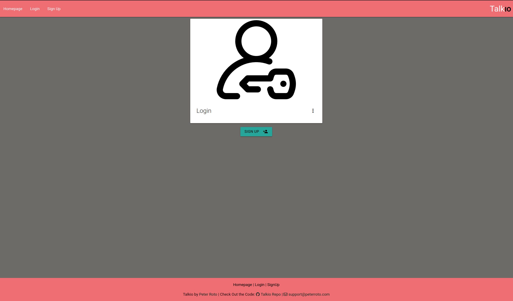
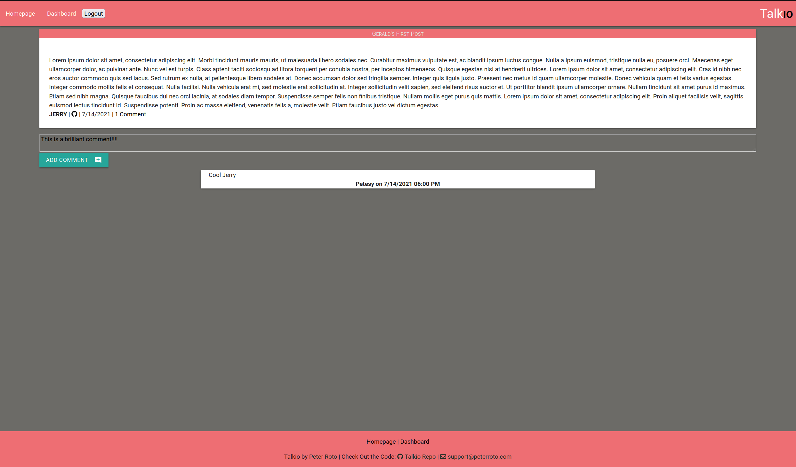

  <h1 align="center">Talkio 🎉 </h1>
    
  <br />
  
  ## 👇  Description  👇
---
  
  Tech Blog Website built with Nodejs, Sequelize, MySQL, Handlebars, and TLC.
 
  ## Table of Contents 
  - [Description](#--description--)
  - [Installation Instructions 📣](#installation-instructions-)
  - [Usage 🖱️](#usage-️)
  - [Contributors 🧑‍🤝‍🧑](#contributors-)
  - [Screenshots 📷](#screenshots-)
  - [Questions ❔](#questions-)
  - [License ©️](#license-️)
    
  ## Installation Instructions 📣
---

Not sure why you would, but . . . . .

1. Clone the repository
2. Run ```npm i``` (install dependencies)
3. Copy [schema.sql](./db/schema.sql) into your MySQL Local Instance (Make the database)
4. Run ```npm run watch``` (starts nodemon as a daemon that restarts the server with any modifications you make)
  
  ## Usage 🖱️
---
| Demonstration on Usage Video |
|:----------------------------:|
|[](https://youtu.be/OYuNV74gkFs "Talkio Demo")|
  
  
  ## Contributors 🧑‍🤝‍🧑
---
  Peter Roto
  
  ## Screenshots 📷
---

  |  Login Screen                              | Post Editing Screen                               | Comments Section                               | 
  |:------------------------------------------------------:|:------------------------------------------------------:|:------------------------------------------------------:|
  |  |||
  |                                                        |                                                        |                                                        |
  |                                                        |                                                        |                                                        |   


  ## Questions ❔

---

  Email me or create an issue here on Github.<br />
  <br />
  :octocat: Find me on GitHub: [PRoto133](https://github.com/PRoto133)<br />
  <br />
  📬 Email me with any questions: support@peterroto.com<br /><br />
  
  ## License 
---
  <br />
  This application is covered by <a href="https://opensource.org/licenses/MIT"> the MIT License</a> license. 

  --------------------------- 
 

  This README was generated with [writemeREADME](https://github.com/proto133/writemeREADME) 
  
